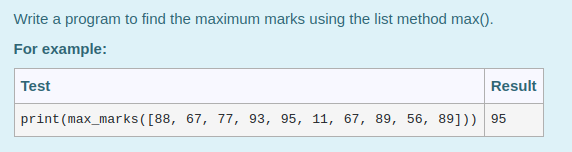
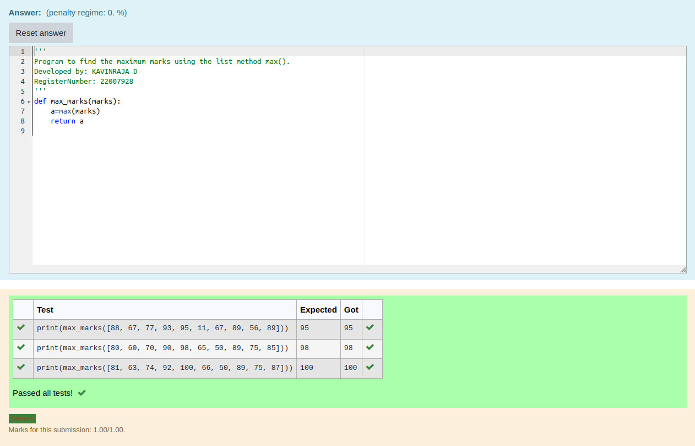

# Find the maximum of a list of numbers
## Aim:
To write a program to find the maximum of a list of numbers.
## Equipment’s required:
1.	Hardware – PCs
2.	Anaconda – Python 3.7 Installation / Moodle-Code Runner
## Algorithm:
1.	Get the list of marks as input
2.	Use the sort() function or max() function or use the for loop to find the maximum mark.
3.	Return the maximum value
## Program:
i)	To find the maximum of marks using the list method sort.
```
Program to mark the maximum of marks using the list method sort
Developed by: KAVINRAJA D 
RegisterNumber: 22007928
def max_marks(marks):
    marks.sort()
    large=marks[-1]
    return large
```
ii)	To find the maximum marks using the list method max().
```
Program to mark the maximum of marks using the list method sort
Developed by: KAVINRAJA D
RegisterNumber: 22007928
def max_marks(marks):
   large = max(marks)
   return large

```
iii) To find the maximum marks without using builtin functions.
```
Program to the maximum marks without using builtin functions.
Developed by:KAVINRAJA D 
RegisterNumber: 22007928
def max_marks(marks):
    large=max(marks)
    return large
```
## Sample Input and Output
i)

 


ii)




iii)


## Output:
i)


ii)



iii)


## Result:
Thus the program to find the maximum of given numbers from the list is written and verified using python programming.